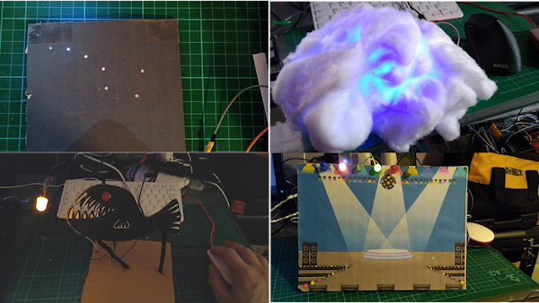

## Introduction

In this project you will combine your knowledge of using LEDs with your creative talents, to produce an artistic light show.

### What you will make

You will create your own 3D crafted model, and add LEDs and maybe some sound, to craft your very own digital art installation.

--- no-print ---

Anglerfish by Jess Smith, in the [Sea Creatures Collection](https://thenounproject.com/spess.22/collection/sea-creatures)
--- /no-print ---

--- print-only ---

Anglerfish by Jess Smith, in the [Sea Creatures Collection](https://thenounproject.com/spess.22/collection/sea-creatures)
--- /print-only ---

--- collapse ---
---
title: What you will need
---
### Hardware

+ A Raspberry Pi computer
+ Jumper leads
+ LEDs
+ Crafting materials

### Software

+ Scratch 3 Desktop
+ Python 3
+ This project can be completed in a web browser using [trinket.io](https://trinket.io/)

--- /collapse ---

--- collapse ---
---
title: What you will learn
---

+ How to use connect multiple LEDs to a Raspberry Pi
+ How to use multiple pins to control LEDs using Scratch
+ How to control LEDs using random patterns or inputs.

--- /collapse ---

--- collapse ---
---
title: Additional information for educators
---

If you need to print this project, please use the [printer-friendly version](https://projects.raspberrypi.org/en/projects/projectName/print){:target="_blank"}.

--- /collapse ---
