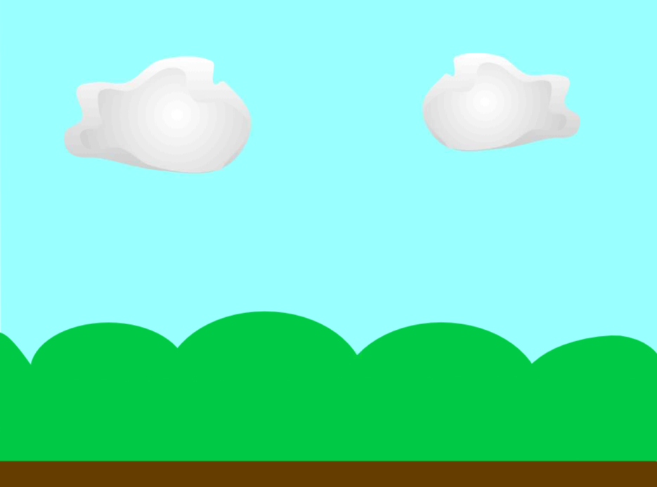

## Design your model

For this project, you are designing a cotton wool thunder cloud that incorporates blue LEDs to simulate lightning. Think about how you will shape the cotton wool to form a natural, fluffy cloud and decide on the best placement for the LED(s) to mimic sudden lightning flashes.

There are some questions you need to ask yourself before you start creating your thunder cloud. Have a think about the questions below.


--- task ---

How many LEDs will you need for your model? What colours will they be? Have you got enough jumper wires for what you are planning to make?


--- /task ---

--- task ---

Once you have built your model, how will the LED or LEDs be controlled? Do you want them to light up randomly, in a regular pattern, be continuously lit, or will they be controlled using mouse or keyboard events?

```blocks3
when flag clicked
forever
toggle LED (21 v) ::extension
```

--- /task ---

--- task ---

Do you want to add sound effects to your model? Will there be graphics on the screen in addition to your model? Do you want people to be able to interact with the screen?



--- /task ---
