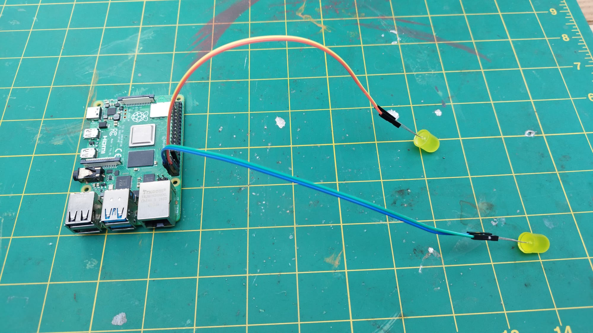
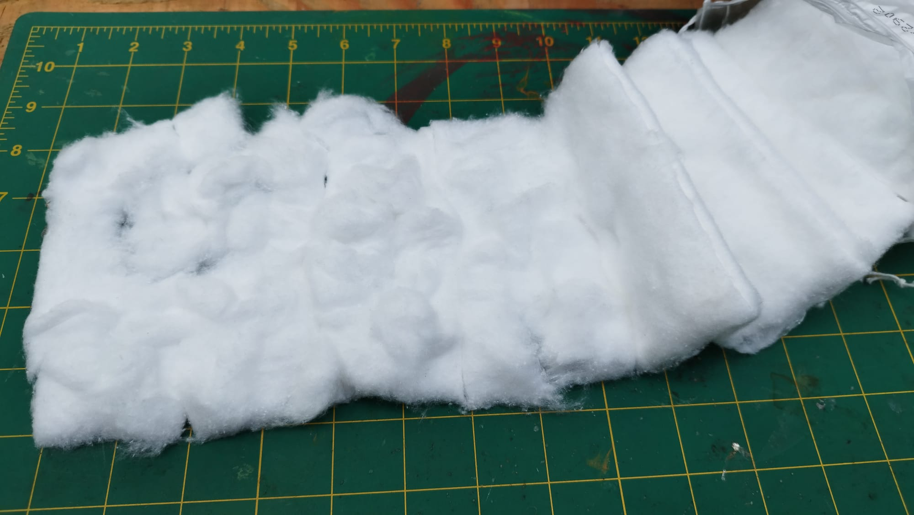
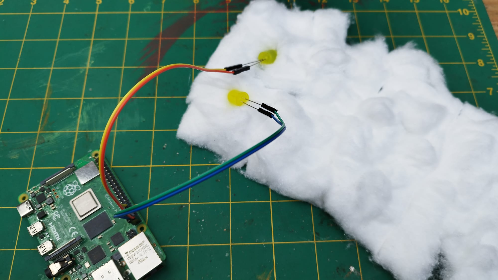
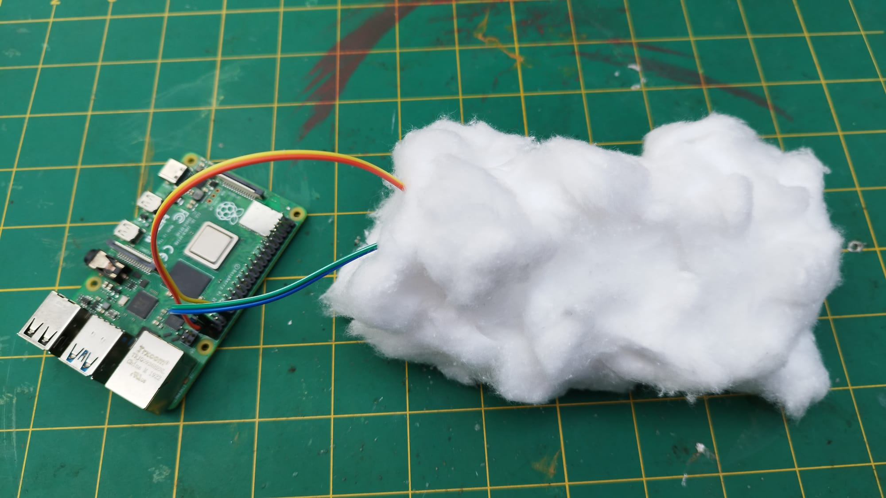

## Build your model

Now that you have a plan, it's time to build your thunder cloud. Below are a few tips that might help you to produce the model you want.


--- task ---

Connect your LEDs to your Raspberry Pi and make sure you remember which GPIO pins you used. In the example, we have used pins 21 and 26.




--- /task ---

--- task ---

Take your cotton wool roll and lay it out flat on the table. Pinch or stretch it gently to make it look fluffy.


--- /task ---

--- task ---

Place your connected LEDs on top the cotton wool and wrap them up, making sure the cables all come out of one end. 



You should place them slightly apart, and could even wrap up one or two, then add more in extra layers to spread them around inside the cloud.

--- /task ---

Your finished cloud should look something like this:


--- collapse ---
---
title: Using a craft or utility knife
---

Craft and utility knives are very useful when making models, but you must be very careful when using them, as they are extremely sharp and can easily cause an injury. If you are using a craft or utility knife, make sure you have a responsible adult with you, or ask them to do the cutting for you if you prefer. It's also a good idea to use a cutting mat to protect the surface you are working on. If you don't have a cutting board, a kitchen chopping board is a great alternative.


--- /collapse ---

--- collapse ---
---
title: Joining together jumper wires
---

You might need extra-long wires to attach your LED to your Raspberry Pi pins. You can do this by 'daisy chaining' wires together. For instance, to make an extra-long Socket-Socket wire, you can attach an Socket-Pin wire to a Socket-Socket wire.


The problem with this method is that often the wires will become detached from each other. You can use a small piece of tape to secure the connection.


--- /collapse ---

--- collapse ---
---
title: Short circuits
---

As the legs of the LEDs are often exposed, it is easy for to create a **short circuit** if the exposed legs touch each other. This will stop your LED from working. A little bit of tape wrapped around each LED leg will prevent this.


This will also help to keep the LED attached to its jumper wires.

--- /collapse ---

--- collapse ---
---
title: Multiple LEDs
---

You might have only used a single LED in your projects before, but you can use lots of LEDs if you want to. Each LED will need its long leg attached to a numbered pin and the short leg attached to a ground pin. You can see the location of all the numbered pins and ground pins in the diagram below.


To control the LEDs, you just change the pin number in your Scratch program so it corresponds to the pin the LED is attached to.

```blocks3
turn LED (21 v) [on v] ::extension
turn LED (26 v) [off v] ::extension
```

--- /collapse ---