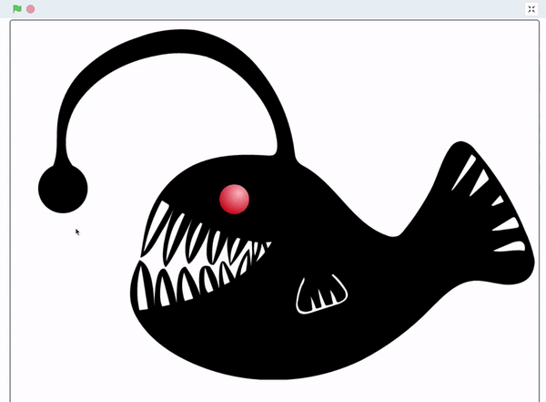

## Add graphics and sound

This step is optional, but you might like to add some graphics and sound to your project. This might be so that people who are using your model are able to control the LEDs, or it might simply be to add some extra effects to your project.

## --- collapse ---

## title: Simulate your project on screen

If you have used an image from Scratch itself as part of your project, or a digital image of your own, you can import it into your Scratch project. Click on the **Choose a Sprite** icon and select **Upload Sprite**.


You can then use the image to copy what your actual model does. Here's the anglerfish example, where clicking on the sprites on the screen illuminates the LEDs and the sprites change their brightness.


\--- /collapse ---

## --- collapse ---

## title: Add a photograph of your project

You could take photos of your project in action, and then import them as backdrops into your Scratch project, so that the image on the screen shows what is happening with the model. Here's an example of the thunder cloud project, using four photographs as different backdrops. The backdrop changes each time the LED comes on.


\--- /collapse ---

## --- collapse ---

## title: Add some sound effects to your project

You could add sound to your Scratch project, so that when the LEDs are turned on or off, Scratch plays a sound effect. For instance, these code blocks will start and stop a sound, in time with an LED turning on and off.

```blocks3
when flag clicked
wait (pick random (1) to (3))
turn LED (21 v) [on v] ::extension
start sound (Cymbal Echo v)
wait (pick random (1) to (3))
turn LED (21 v) [off v] ::extension
stop all sounds
```

\--- /collapse ---
