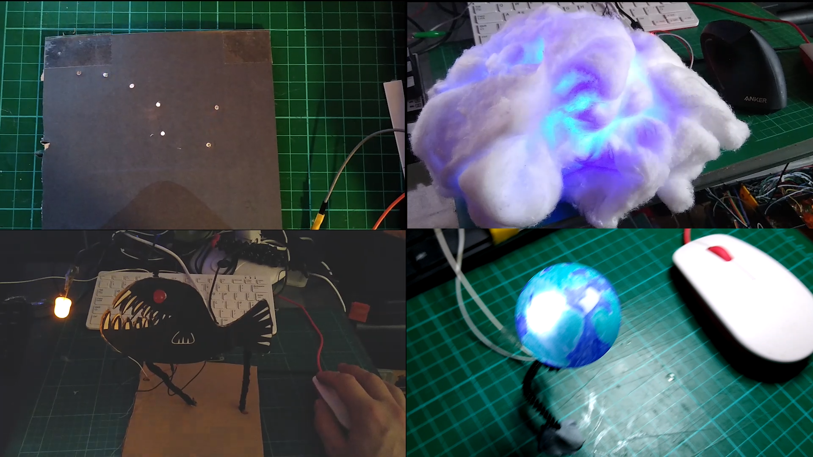

## 您将创建

制作一个科学或自然的 3D 装置。 您将创建自己的 3D 手工模型，并添加 LED 和声音，以制作您自己的数字演示。

您将要：

- 将多个LED连接到树莓派。
- 使用 Scratch 并通过多个引脚控制 LED
- 使用随机模式或输入控制 LED

为了完成这个项目你需要：

### 硬件

- 一台树莓派电脑
- 跳线
- 发光二极管LED
- 制造材料

### 软件

- Scratch 3 桌面版 - **此项目无法使用在线 Scratch 3 编辑器完成**，必须使用安装了桌面版的树莓派上完成。

\--- no-print ---

安康鱼，作者 Jess Smith，出自 [海洋生物系列](https://thenounproject.com/spess.22/collection/sea-creatures){:target="_blank"}。

\--- /no-print ---

\--- print-only ---

Jess Smith 创作的琵琶鱼，收录于 [海洋生物系列](https://thenounproject.com/spess.22/collection/sea-creatures){:target="_blank"}。

\--- /print-only ---

如果您需要打印这个项目，请使用[适合打印的版本](https://projects.raspberrypi.org/en/projects/projectName/print){:target="_blank"}。
