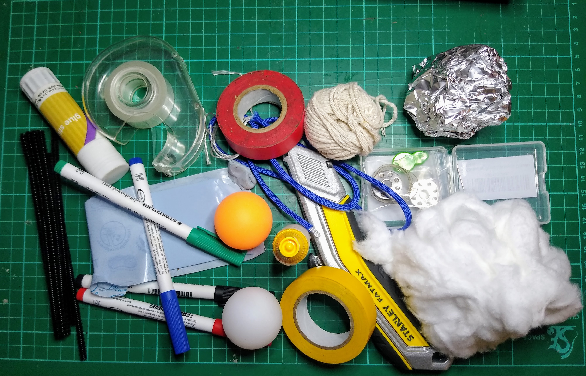
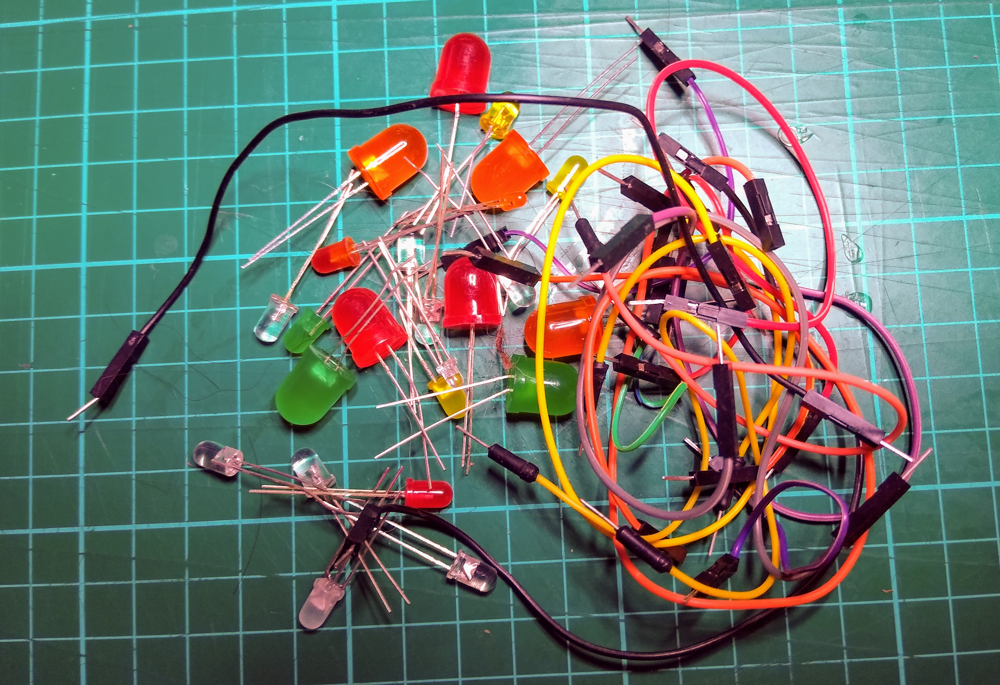
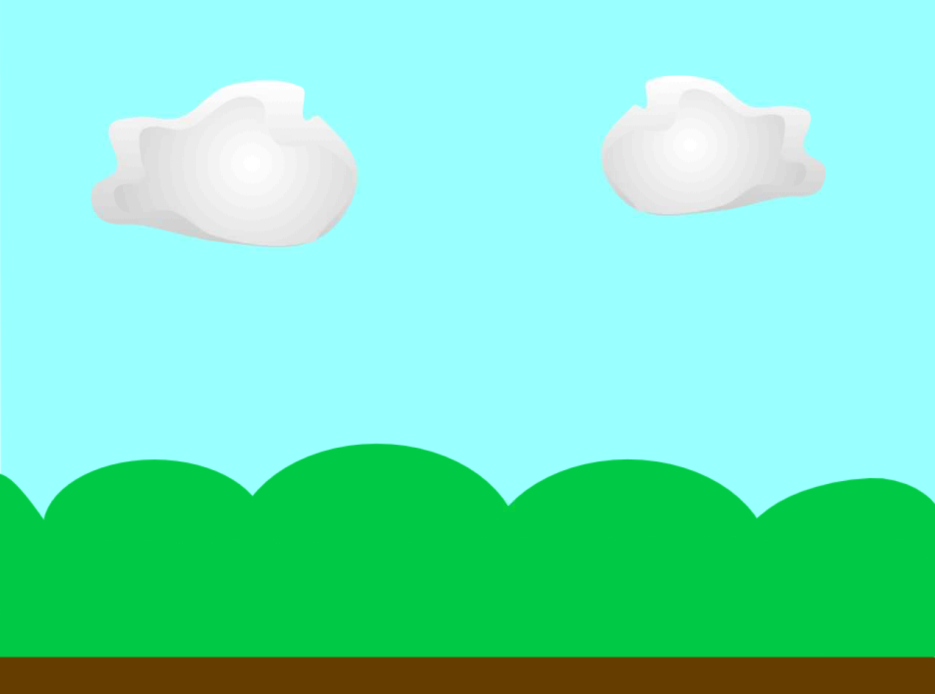

## Choose your model

Now it’s time to work on your own project. You may have lots of ideas already, or you may need to take a few minutes to decide on a theme.

\--- task ---

Think about the model you would like to make. You could copy or adapt one of the examples in the video in the previous step, or you could come up with something completely different.

For example:

1. You could use cotton wool and a pair of blue LEDs to make your own 3D thunder cloud
2. You could use a ping-pong ball and a red LED to make a 3D model of Mars
3. You could use a yellow LED and create your own model of a firefly

\--- /task ---

There are many questions you need to ask yourself before you start creating your model. Have a think about the questions below.

\--- task ---

Once you have chosen what you want to make a model of, consider what craft materials will you need, and are they readily available to you?



\--- /task ---

\--- task ---

How many LEDs will you need for your model? What colours will they be? Have you got enough jumper wires for what you are planning to make?



\--- /task ---

\--- task ---

Once you have built your model, how will the LED or LEDs be controlled? Do you want them to light up randomly, in a regular pattern, be continuously lit, or will they be controlled using mouse or keyboard events?

```blocks3
when flag clicked
forever
toggle LED (21 v) ::extension
```

\--- /task ---

\--- task ---

Do you want to add sound effects to your model? Will there be graphics on the screen in addition to your model? Do you want people to be able to interact with the screen?



\--- /task ---
