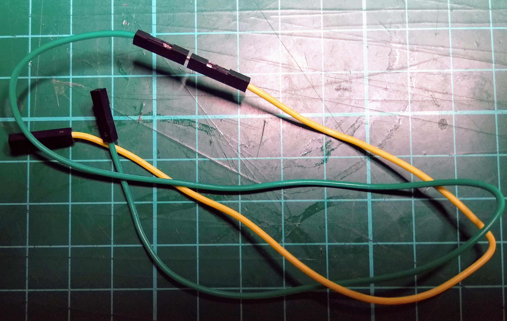

## 构建您的模型

现在您已经有了想法，是时候构建您的模型了。 下面有一些可能有助于您制作所需模型的技巧。

## --- collapse ---

## 标题：使用工艺刀或美工刀

工艺刀和多用途刀在制作模型时非常有用，但您在使用时必须非常小心，因为它们非常锋利，很容易造成伤害。 如果您使用工艺刀或多用途刀，请确保有一位成年监护人陪同您，或者如果您愿意的话，请他们为您切割。 使用切割垫来保护您工作的桌面也是一个好主意。 如果您没有切割板，厨房砧板是一个很好的替代品。


\--- /collapse ---

## --- collapse ---

## 标题：连接跳线

你可能需要超长电线才能将你的 LED 连接到你的树莓派引脚。 您可以通过“串联”电线来实现这一点 例如，要制作超长的插座-插座线，您可以将插座-针脚线连接到插座-插座线。



这种方法的问题是电线经常会彼此脱落。 您可以使用一小块胶带来固定连接。


\--- /collapse ---

## --- collapse ---

## 标题：短路

由于 LED 的引脚经常暴露在外，如果暴露的引脚互相接触，很容易形成**短路**。 这将导致你的 LED 停止工作。 在每个 LED 灯脚上缠上一点胶带即可防止这种情况发生。


这也有助于将 LED 保持与其跳线的连接。

\--- /collapse ---

## --- collapse ---

## 标题：多个 LED

您之前可能只在项目中使用过单个 LED，但如果您愿意，您可以使用多个 LED。 每个 LED 都需要将其长脚连接到带编号的引脚，将短脚连接到接地引脚。 您可以在下图中看到所有带编号引脚和接地引脚的位置。


要控制 LED，只需更改 Scratch 程序中的引脚号，使其与 LED 所连接的引脚相对应。

```blocks3
turn LED (21 v) [on v] ::extension
turn LED (26 v) [off v] ::extension
```

\--- /collapse ---
