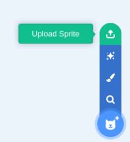
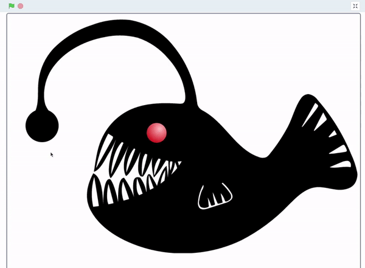

## 添加图形和声音

这步骤是可选的，但您可能希望在项目中添加一些图形和声音。 这可能是为了让使用您模型的人能够控制 LED，或者可能只是为了给您的项目添加一些额外的效果。

--- collapse ---
---
title: 在屏幕上模拟您的项目
---

如果您已使用 Scratch 自带的图像作为项目的一部分，或者您自己的数码图像，则可以将其导入到 Scratch 项目中。 点击**选择精灵**图标并选择**上传精灵**。



然后您可以使用此图像来复制您的模型中并使用。 这是安康鱼的示例，单击屏幕上的精灵会点亮 LED，并且精灵会改变其亮度。


--- /collapse ---

--- collapse ---
---
title: 添加项目的照片
---

您可以拍摄项目运行时的照片，然后将它们作为背景导入到 Scratch 项目中，以便屏幕上的图像显示模型正在发生的情况。 这是雷云项目的一个例子，使用四张照片作为不同的背景。 每次 LED 亮起时，背景都会发生变化。


--- /collapse ---

--- collapse ---
---
title: 为你的项目添加一些音效
---

您可以向 Scratch 项目添加声音，这样当 LED 打开或关闭时，Scratch 就会播放声音效果。 例如，这些代码块将随着 LED 的打开和关闭而启动和停止声音。

```blocks3
when flag clicked
wait (pick random (1) to (3))
turn LED (21 v) [on v] ::extension
start sound (Cymbal Echo v)
wait (pick random (1) to (3))
turn LED (21 v) [off v] ::extension
stop all sounds
```

--- /collapse ---
